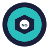

# Nutrigenetic Shop

Ein moderner E-Commerce-Shop für personalisierte Nahrungsergänzungsmittel basierend auf genetischen Faktoren.



## Über das Projekt

Nutrigenetic bietet personalisierte Nahrungsergänzungsmittel, die auf die individuellen genetischen Faktoren und Blutgruppen der Kunden abgestimmt sind. Unser Ziel ist es, jedem Menschen zu helfen, seine Gesundheit selbst in die Hand zu nehmen.

## Technologien

- React 18
- TypeScript
- Tailwind CSS
- Vite
- Stripe für Zahlungsabwicklung
- EmailJS für Kontaktformulare

## Features

- Responsive Design für alle Geräte
- Produktkatalog mit detaillierten Produktinformationen
- Warenkorb-Funktionalität
- Checkout-Prozess mit Stripe-Integration
- Wunschliste für Lieblingsprodukte
- Produktbewertungen und Testimonials
- Gesundheitsquiz zur Produktempfehlung
- Newsletter-Anmeldung
- Kontaktformular

## Installation

```bash
# Repository klonen
git clone https://github.com/yourusername/nutrigenetic-shop.git
cd nutrigenetic-shop

# Abhängigkeiten installieren
npm install

# Entwicklungsserver starten
npm run dev
```

## Umgebungsvariablen

Erstellen Sie eine `.env`-Datei im Hauptverzeichnis mit folgenden Variablen:

```
VITE_STRIPE_PUBLIC_KEY=your_stripe_public_key
VITE_EMAILJS_SERVICE_ID=your_emailjs_service_id
VITE_EMAILJS_TEMPLATE_ID=your_emailjs_template_id
VITE_EMAILJS_USER_ID=your_emailjs_user_id
```

## Deployment

Die Anwendung kann einfach auf Netlify oder Vercel deployt werden:

1. GitHub-Repository erstellen
2. Repository mit Netlify/Vercel verbinden
3. Build-Einstellungen konfigurieren:
   - Build-Befehl: `npm run build`
   - Veröffentlichungsverzeichnis: `dist`

## Beitragen

Beiträge sind willkommen! Bitte folgen Sie diesen Schritten:

1. Forken Sie das Repository
2. Erstellen Sie einen Feature-Branch (`git checkout -b feature/amazing-feature`)
3. Committen Sie Ihre Änderungen (`git commit -m 'Add some amazing feature'`)
4. Pushen Sie den Branch (`git push origin feature/amazing-feature`)
5. Öffnen Sie einen Pull Request

## Lizenz

Dieses Projekt ist unter der MIT-Lizenz lizenziert. Weitere Details finden Sie in der [LICENSE](LICENSE)-Datei.

## Kontakt

Nutrigenetic - [nutrigenetic.shop@gmx.de](mailto:nutrigenetic.shop@gmx.de)

Projektlink: [https://github.com/yourusername/nutrigenetic-shop](https://github.com/yourusername/nutrigenetic-shop)